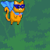

✨_____________________________________________________________________________________________________________✨ 
                                          
  ##So_Long

    
Ce projet consiste à développer un petit jeu en 2D en utilisant la miniLibX

  

✔️ Compréhension et l'utilisation de miniLibX, 
✔️ Gestion des ressources graphiques, 
✔️ Structuration du code, 
✔️ Manipulation d'images,
✔️ Gestion des événements,

  

